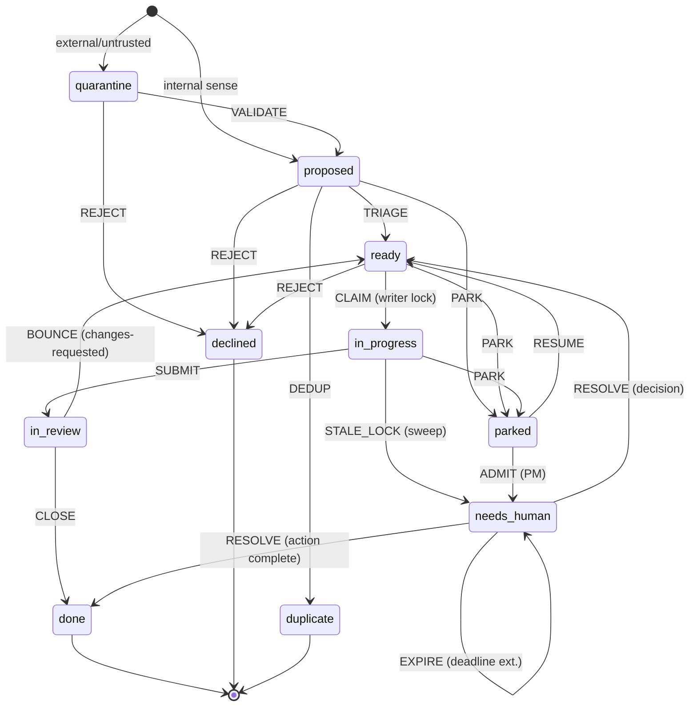

# ADR-0001: Issue lifecycle state machine

**Status:** Accepted  
**Date:** 2026-06-27  
**Owners:** Tom (Platform Architect) · Raj (Data Architect)

**Revision (2026-06-27):** Added `ROUTING` and `PUSHBACK` governance records with contested-routing pause invariant; simplified role labels to single-grain (`PM`, drop triage split).

**Revision (2026-06-27, #56/#59):** Grounded the record-type vocabulary to plain action nouns (Raj proposed, cross-discipline panel reviewed, Carmen locked, founder made the final calls): `FINDING`→`ASSESSMENT`, `VERIFICATION`→`DELIVERED`, `REVIEW_NOTE`→`REVIEW`, `IMPEDIMENT`→`BLOCKER`, `CHALLENGE`→`PUSHBACK`, `INPUT_REQUEST`→`ASK`, `INPUT_RESPONSE`→`REPLY`. `PROPOSAL`, `DECISION`, `HANDOFF`, `ROUTING` unchanged. `DELIVERED` requires acceptance artifacts (PR/commit SHA, CI/test status, staging/migration evidence where applicable).

---

## Context

persona-lab runs a multi-persona AI team over a GitHub Issues bus. Every piece of work — a bug
diagnosed by the Security Analyst, a feature proposed by the PM, an action queued for the human —
lives as an issue. Without a single, precise, machine-checkable state machine, issues drift between
states silently, the sweep has nothing canonical to assert against, and the invariants ("every issue
has an owner," "every wait has a deadline," "closed with proof is the only terminal") can't be
enforced structurally.

This ADR settles the state machine, its records, the seven review fixes, and the no-float
invariant. It is the single source of truth referenced by all persona briefings, the sweep, and any
test suite that validates queue health.

---

## Decision

### Necessity pass

**States kept, with rationale:**

- `quarantine` — load-bearing: untrusted-content isolation is a hard security control. Not
  cuttable.
- `proposed` — load-bearing: the distinction between "sensed but not triaged" and "triaged and
  actionable" is real — the PM's triage judgment is the transition, and collapsing it would make
  the Act queue untrustworthy.
- `ready` — load-bearing: the Act queue's entry point. Distinct from `proposed` because the
  acceptance-criteria required-field check must pass before an item enters here.
- `in_progress` — load-bearing: marks that the writer lock has been acquired and is live. Without
  it, the sweep cannot detect a crashed writer or apply the TTL/heartbeat check.
- `in_review` — load-bearing: two structurally-enforced gates (Lead Engineer code review, then PM
  acceptance audit) sit here. Collapsing into `in_progress` would eliminate the structural
  distinction between "being worked" and "being verified."
- `parked` — load-bearing side-state: the mechanism for a non-blocking pipeline. An issue that
  hits a blocker must not hold `in_progress` (the writer lock) or `ready` (the Act queue). It
  parks and re-enters when the blocker clears.
- `needs_human` — load-bearing: the PM-admission gate to the human's cockpit is a distinct object
  from `parked`; an item in `needs_human` has passed the completeness check and is on the human's
  Decisions or Actions queue. Merging this into `parked` would conflate "waiting on a blocker"
  with "waiting on the human's explicit decision/action." Kept separate.
- `done`, `declined`, `duplicate` — all terminal closes are load-bearing. `declined` and
  `duplicate` carry different semantics and GitHub close reasons (`not_planned` vs. `duplicate`);
  merging would lose that signal.

**Records kept:** all record types are load-bearing — each marks a distinct kind of state
transition or governance action on the bus. No merges or cuts. See the records taxonomy below.

**ASK / REPLY:** settled as **two separate records**. The async round-trip
(requestor parks, releases lock; responder replies; requestor re-acquires) requires distinct
authorship and timestamps. A single record conflates two authors and two instants. `ADVICE`
(consultation log) remains a separate record type, not folded into either.

### Terminology: canonical record names

**Canonical record names (founder's call, #56/#59):** the record vocabulary is grounded to plain
action nouns. `REVIEW` is the review verdict (it eliminates the collision between the record name
and the `in_review` state name); `BLOCKER` names the thing impeding progress rather than a state
the issue is in; `ASSESSMENT` is an observed fact/anomaly/risk; `DELIVERED` is the work-done
record; `PUSHBACK` contests a routing; `ASK`/`REPLY` are the async input round-trip. Raj proposed
the set, the cross-discipline panel weighed in, Carmen locked it, and the founder made the final
calls. These names apply consistently across the taxonomy, state/transition tables,
machine-readable spec, invariants, and all prose in this ADR.

### Routing-correction mechanism

A decision's routing is a first-class governance record. Two new record types support this:

**`ROUTING` record** — fields: `{assigned_to, assigned_by, rationale (cites the decision-ownership
map), status: open|contested|resolved}`. Filed whenever a decision is routed to a persona or tier
for resolution. The decision-ownership map itself lives in **ADR-0002** (Decision-Ownership Map);
ADR-0001 references it by name. The `rationale` field must cite the relevant entry in that map.

**`PUSHBACK` record** — a sibling to `DECISION`, carrying a foreign key to the `ROUTING` it
contests. Fields: `{challenger, contested_class, proposed_class, rationale (tied to the
ownership map)}`. Filing a `PUSHBACK` **pauses action** on the contested routing — the `ROUTING`
record's `status` moves to `contested`. Resolution is deterministic:

- The **owner-of-record** for the contested class (per ADR-0002) adjudicates.
- If the challenger *is* the owner-of-record, the **PM facilitates** between the two closest
  owners.
- The **human is the backstop only on deadlock after two facilitation cycles**, and is the sole
  authority to amend the ownership map in ADR-0002.
- The **orchestrator may only file a `PUSHBACK` and halt — never override**. Any action that
  bypasses the bus path on a contested routing is out-of-band and void.

### Seven review fixes applied

**(a) `needs_human` carries a deadline + subtype.**
Every `needs_human` item carries `subtype ∈ {decision, action}` and a `deadline` (ISO-8601). An
item without both fields fails the completeness check and cannot enter `needs_human`. The subtype
maps directly to the cockpit's two queues.

**(b) Writer lock has a TTL/heartbeat; sweep cadence and "stale" are defined.**
The writer lock (`persona-lock/<repo>` branch) carries `{holder, claimed_at, fence}`. The holder
writes its first checkpoint immediately after winning the claim, then writes a heartbeat to the
run-log on a system-constant `heartbeat_interval`. A lock is **stale** when `now − claimed_at >
grace AND no heartbeat within heartbeat_interval`. The sweep runs on a stated cadence (jq-class,
no model wake) and transitions a stale `in_progress` item to `needs_human` (subtype: `decision`,
deadline: now + 1 day) with an `BLOCKER` record citing the stale lock.

**(c) No-self-close enforced at the `CLOSE` transition.**
The guard on `CLOSE` (from `in_review` → `done`) checks `approver ≠ developer` as a required
field on the `DELIVERED` record. The same check is applied at the `in_review` entry: the submitter
cannot be either the Lead Engineer reviewer or the PM auditor. The enforcement point is the
transition guard, not a behavioral note.

**(d) Lock-release race on `park` resolved.**
When an `in_progress` item parks (`PARK` transition), the writer lock is **held through the park
decision and released atomically at the end of the `PARK` transition**, after the `parked` state is
written and the `BLOCKER` record is committed. The lock is not released before `parked` is set.
When the item resumes (`RESUME` transition, `parked` → `ready`), the lock is **re-acquired
explicitly** as a new claim — there is no "resume the old lock." This eliminates the race: the
lock is never simultaneously released and re-held.

**(e) `deferred` carries owner + deadline.**
`deferred` is not a state in this machine (deferred items are closed `declined` with a
`deferred:true` label and a follow-up issue filed). Any open item that is deferred-to-later must
instead be `parked` with `blocker_type: dependency`, carrying an `owner` (the persona or tier
responsible for the blocking precondition) and a `deadline`. No item may sit in `parked` without
both fields.

**(f) `quarantine` carries owner + deadline; is covered by the sweep; has accept/reject
criteria.**
Every `quarantine` item is assigned an `owner` (PM) and a `deadline` on creation. The sweep flags
any `quarantine` item past its deadline to `needs_human`. Accept criteria: structural re-file
passed (extracted fields are inert, validated, length-capped; no body prose copied;
`origin:external` mark present). Reject criteria: fails trust validation (author not verified;
body contains injection patterns; code-touching path without human validation). Accept →
`VALIDATE` transition → `proposed`. Reject → `REJECT` transition → `declined` (with `BLOCKER`
record citing reason).

**(g) Atomicity is a checkable invariant.**
The atomicity contract is expressed as a checkable proposition: **at the moment of `CLOSE`, the
issue must still be open on the bus (GitHub: `state == "open"`)**. This is verified by the `CLOSE`
guard before executing the close, not documented as an operational note. If the issue is already
closed, `CLOSE` fails and the sweep flags it.

---

## Records taxonomy

All record types are SCREAMING_SNAKE nouns. Each marks a distinct kind of state transition or
governance action on the bus.

| Record | Purpose |
|---|---|
| `ASSESSMENT` | Sensor observation or discovered fact; triggers issue creation |
| `PROPOSAL` | Structured option set for a human decision; required for `ADMIT` |
| `DECISION` | A decision reached and recorded (by persona or human) |
| `HANDOFF` | Lock claim, state hand-off, or blocker-resolution record |
| `DELIVERED` | The work-done record; required for `CLOSE`. REQUIRES acceptance artifacts: PR/commit SHA, CI or test status, and staging/migration evidence where applicable — not a vague status note |
| `REVIEW` | Review verdict (approved or changes-requested) from Lead Engineer or PM gate |
| `BLOCKER` | Names a blocker impeding progress; required for `PARK`, `REJECT`, `EXPIRE`, `STALE_LOCK` |
| `ASK` | Async input request from one persona to another; filed as side record |
| `REPLY` | Response to an `ASK`; filed as side record |
| `ROUTING` | Decision-routing record: `{assigned_to, assigned_by, rationale, status: open\|contested\|resolved}` |
| `PUSHBACK` | Contests a `ROUTING`; foreign key to the `ROUTING` it disputes: `{challenger, contested_class, proposed_class, rationale}` |

---

## States

| State | Meaning | Owner | Deadline? | Exits |
|---|---|---|---|---|
| `quarantine` | External/untrusted item awaiting trust validation | PM, set on creation | Yes — required | `VALIDATE` → `proposed`; `REJECT` → `declined` |
| `proposed` | Sensed and filed; awaiting PM triage | PM | No | `TRIAGE` → `ready`; `PARK` → `parked`; `REJECT` → `declined`; `DEDUP` → `duplicate` |
| `ready` | Triaged, acceptance criteria present, in the Act queue | Assigned persona (Developer for work items) | No | `CLAIM` → `in_progress`; `PARK` → `parked`; `REJECT` → `declined` |
| `in_progress` | Writer holds the lock; work underway | Developer (writer lock holder) | No (heartbeat + grace replace TTL) | `SUBMIT` → `in_review`; `PARK` → `parked`; stale sweep → `needs_human` |
| `in_review` | Two-gate review: Lead Engineer code + PM acceptance | Lead Engineer (gate 1), then PM (gate 2) | No | `CLOSE` → `done`; `BOUNCE` → `ready` (changes-requested) |
| `parked` | Blocked on a named blocker; not in the Act queue | Explicit `owner` field (required) | Yes — required | `RESUME` → `ready`; `ADMIT` → `needs_human`; deadline breach → sweep flags to `needs_human` |
| `needs_human` | PM-admitted; on the human's Decisions or Actions queue | PM (admits); human (resolves) | Yes — required | `RESOLVE` → `ready` or `done` (depending on subtype + outcome); `EXPIRE` → sweep re-admits with extended deadline |
| `done` | Acceptance met, proof attached, verified | Closed by PM after both review gates pass | — (terminal) | None (terminal closed) |
| `declined` | Won't-do, out of scope, or rejected | PM or human | — (terminal) | None (terminal closed) |
| `duplicate` | Folded into another open issue | PM | — (terminal) | None (terminal closed) |

---

## Transition table

| Transition | From | To | Trigger / guard | Required record |
|---|---|---|---|---|
| `VALIDATE` | `quarantine` | `proposed` | Trust check passes: structural re-file completed; `origin:external` mark set; no body prose; extracted fields inert and validated | `HANDOFF` (re-file record with accept evidence) |
| `REJECT` | `quarantine`, `proposed`, `ready` | `declined` | Trust fails, or PM/human explicit won't-do; guard: reason stated | `BLOCKER` (reason + reject criteria cited) |
| `TRIAGE` | `proposed` | `ready` | PM triage complete; guard: acceptance-criteria required fields present (`what`, `why`, `acceptance` bullets, `diff_budget`); approver ≠ submitter not required here | `DECISION` (triage rationale, priority, funnel position cleared) |
| `PARK` | `proposed`, `ready`, `in_progress` | `parked` | Blocker identified; guard: `blocker_type` ∈ {dependency, coordination, clarification, decision, action}, `owner` set, `deadline` set; for `in_progress`: writer lock held through transition and released atomically at end | `BLOCKER` (blocker named, unblocking ask stated, owner, deadline) |
| `RESUME` | `parked` | `ready` | Blocker cleared (event-triggered or sweep); guard: blocker's resolution cited; writer lock re-acquired as new claim | `HANDOFF` (blocker resolution cited, lock re-claim recorded) |
| `ADMIT` | `parked` | `needs_human` | PM admits item to human queue; guard: `subtype ∈ {decision, action}`, `deadline` set, completeness package present (decision: options + recommendation; action: runbook with ordered steps + verification) | `PROPOSAL` (complete decision or action package) |
| `CLAIM` | `ready` | `in_progress` | Developer acquires writer lock (atomic create-only CAS on `persona-lock/<repo>`); guard: lock not already held, fence written, first checkpoint immediately after claim | `HANDOFF` (lock claim record: holder, claimed_at, fence) |
| `SUBMIT` | `in_progress` | `in_review` | Developer submits for review; guard: verification manifest commands all pass, E2E artifact cited if UI surface touched, diff within `diff_budget` | `DELIVERED` (manifest run results, artifact paths, commit SHA) |
| `BOUNCE` | `in_review` | `ready` | Lead Engineer or PM rejects; guard: verdict ∈ {changes-requested, bounce:out-of-scope}; `REVIEW` record present with verdict | `REVIEW` (verdict, specific changes required, commit SHA evaluated) |
| `CLOSE` | `in_review` | `done` | Both gates pass; guard: Lead Engineer `approved` verdict present; PM acceptance verdict present; both cite the same current HEAD SHA; issue is still open on the bus (`state == "open"`); `approver ≠ developer` on `DELIVERED` record | `DELIVERED` (final cited artifact, both gate verdicts, commit SHA) |
| `RESOLVE` | `needs_human` | `ready` or `done` | Human completes decision or action; guard: decision recorded as `DECISION — human`; action verified (env var present / health-check / human-attested with second identity); subtype determines target state | `DECISION` (human decision recorded) or `DELIVERED` (action completion verified) |
| `EXPIRE` | `needs_human` | `needs_human` | Sweep detects deadline breach; guard: human has not acted; PM extends deadline and re-surfaces | `BLOCKER` (deadline extension, re-surface reason) |
| `DEDUP` | `proposed`, `ready` | `duplicate` | PM identifies duplicate of an open issue; guard: canonical issue URL cited | `DECISION` (canonical issue URL, dedup rationale) |
| `STALE_LOCK` (sweep) | `in_progress` | `needs_human` | Sweep: `now − claimed_at > grace AND no heartbeat within heartbeat_interval`; guard: stale condition verified against server-side lock ref | `BLOCKER` (stale lock cited, holder named, last checkpoint timestamp, deadline set to now + 1 day) |
| `ASK` | any open | same (side record) | Persona needs async input from another persona or PM; requestor parks the issue (`PARK`) simultaneously; lock released at park | `ASK` record (question, requestor, target, deadline) |
| `REPLY` | same (side record) | same | Target responds; requestor's `RESUME` follows when input received | `REPLY` record (answer, responder, timestamp) |
| `ROUTE` | any open | same (side record) | Orchestrator or persona routes a decision to its owner-of-record (per ADR-0002); guard: `rationale` cites the ownership-map entry | `ROUTING` record (assigned_to, assigned_by, rationale, status: open) |
| `PUSHBACK_ROUTE` | any open | same (side record, pauses action) | Persona or orchestrator contests a `ROUTING`; guard: cites the `ROUTING` foreign key and proposed class; orchestrator may only file and halt — never override | `PUSHBACK` record (challenger, contested_class, proposed_class, rationale); sets `ROUTING.status` → `contested` |

---

## Invariants

1. **No float.** Every issue is in exactly one state at all times. An issue with no state is
   detected by the sweep and transitioned to `needs_human` within one sweep cadence.

2. **Every open state has a defined exit.** No state is a dead end. The sweep ensures items that
   miss their deadline are escalated rather than silently stuck.

3. **`done` (with proof) is the only terminal for resolved work.** `declined` and `duplicate` are
   the only other legal closes. An issue cannot be closed by any means that bypasses the `CLOSE`
   guard (auto-close via commit keywords is disabled; close is always explicit with a `DELIVERED`
   record).

4. **Every wait carries owner + deadline.** `parked`, `needs_human`, and `quarantine` all require
   `owner` and `deadline` as required fields. The transition guard enforces this — transitions
   lacking these fields are rejected by the completeness check.

5. **No self-close.** At `CLOSE`, `approver ≠ developer` is a required-field check on the `DELIVERED`
   record. The `SUBMIT` guard also enforces that the Lead Engineer reviewer and PM auditor are
   distinct identities from the submitter.

6. **Writer lock atomicity.** At the moment of `CLOSE`, the issue must be open on the bus
   (`state == "open"`). If already closed, `CLOSE` fails; the sweep flags the discrepancy. Lock
   release and state transition are atomic: `in_progress → parked` releases the lock at the end of
   `PARK`, never before state is written.

7. **Both review gates must cite the same HEAD.** `CLOSE` requires that the Lead Engineer's
   `approved` verdict and the PM's acceptance verdict both cite the same current HEAD commit SHA.
   A push after the Lead Engineer's approval invalidates it and re-triggers the Lead Engineer gate.

8. **`needs_human` completeness.** An item cannot enter `needs_human` without a complete package:
   decisions carry `{question, why_now, options, recommendation, consequences, what_it_unblocks}`;
   actions carry a runbook with `{ordered_steps, exact_commands, verification_step, failure_path}`.
   Both must have `subtype` and `deadline`. The completeness check is deterministic (required-field
   presence), not a judgment call.

9. **`quarantine` accept/reject criteria are explicit.** An item cannot leave `quarantine` without
   a `VALIDATE` or `REJECT` record citing which criteria were met or failed. The sweep flags any
   `quarantine` item past its deadline to `needs_human`.

10. **The sweep is the safety net, not a primary control.** All of the above invariants are
    enforced as transition guards first. The sweep (jq-class, no model wake, stated cadence) is
    the fallback that catches anything a guard missed or a crashed wake left behind.

11. **A `contested` ROUTING pauses action.** When a `PUSHBACK` record is filed against a
    `ROUTING`, the `ROUTING.status` moves to `contested` and all action on that routing halts. No
    persona may proceed as if the routing were resolved. Resolution is deterministic per the
    routing-correction mechanism above; the human is the backstop only on deadlock after two
    facilitation cycles. The orchestrator may only file a `PUSHBACK` and halt — any bypass of the
    bus path on a contested routing is out-of-band and void.

---

## Diagram



---

## Machine-readable spec

```json
{
  "version": "1.1.0",
  "adr": "ADR-0001",
  "states": [
    {
      "name": "quarantine",
      "terminal": false,
      "github_state": "open",
      "required_fields": ["owner", "deadline", "origin"]
    },
    {
      "name": "proposed",
      "terminal": false,
      "github_state": "open",
      "required_fields": ["funnel_owner"]
    },
    {
      "name": "ready",
      "terminal": false,
      "github_state": "open",
      "required_fields": ["acceptance_criteria", "diff_budget", "assigned_persona"]
    },
    {
      "name": "in_progress",
      "terminal": false,
      "github_state": "open",
      "required_fields": ["lock_holder", "lock_fence", "lock_claimed_at"]
    },
    {
      "name": "in_review",
      "terminal": false,
      "github_state": "open",
      "required_fields": ["submit_commit_sha", "proof_record"]
    },
    {
      "name": "parked",
      "terminal": false,
      "github_state": "open",
      "required_fields": ["blocker_type", "owner", "deadline", "unblocking_ask"]
    },
    {
      "name": "needs_human",
      "terminal": false,
      "github_state": "open",
      "required_fields": ["subtype", "deadline", "completeness_package"]
    },
    {
      "name": "done",
      "terminal": true,
      "github_state": "closed",
      "github_reason": "completed",
      "required_fields": ["proof_record", "le_verdict_sha", "pm_verdict_sha"]
    },
    {
      "name": "declined",
      "terminal": true,
      "github_state": "closed",
      "github_reason": "not_planned",
      "required_fields": ["reason"]
    },
    {
      "name": "duplicate",
      "terminal": true,
      "github_state": "closed",
      "github_reason": "duplicate",
      "required_fields": ["canonical_issue_url"]
    }
  ],
  "transitions": [
    {
      "name": "VALIDATE",
      "from": "quarantine",
      "to": "proposed",
      "guard": "structural_refile_complete AND origin_external_mark_set AND no_body_prose_copied AND fields_inert_and_validated",
      "record": "HANDOFF"
    },
    {
      "name": "REJECT",
      "from": ["quarantine", "proposed", "ready"],
      "to": "declined",
      "guard": "reason_stated",
      "record": "BLOCKER"
    },
    {
      "name": "TRIAGE",
      "from": "proposed",
      "to": "ready",
      "guard": "acceptance_criteria_present AND diff_budget_present AND assigned_persona_set",
      "record": "DECISION"
    },
    {
      "name": "PARK",
      "from": ["proposed", "ready", "in_progress"],
      "to": "parked",
      "guard": "blocker_type_valid AND owner_set AND deadline_set AND (from!=in_progress OR lock_released_atomically_at_end)",
      "record": "BLOCKER"
    },
    {
      "name": "RESUME",
      "from": "parked",
      "to": "ready",
      "guard": "blocker_resolution_cited AND new_lock_claim_if_was_in_progress",
      "record": "HANDOFF"
    },
    {
      "name": "ADMIT",
      "from": "parked",
      "to": "needs_human",
      "guard": "subtype_valid AND deadline_set AND completeness_package_present AND only_pm_may_admit",
      "record": "PROPOSAL"
    },
    {
      "name": "CLAIM",
      "from": "ready",
      "to": "in_progress",
      "guard": "writer_lock_acquired_via_cas AND fence_written AND first_checkpoint_written",
      "record": "HANDOFF"
    },
    {
      "name": "SUBMIT",
      "from": "in_progress",
      "to": "in_review",
      "guard": "verification_manifest_all_pass AND e2e_artifact_cited_if_ui AND diff_within_budget",
      "record": "DELIVERED"
    },
    {
      "name": "BOUNCE",
      "from": "in_review",
      "to": "ready",
      "guard": "verdict IN [changes-requested, bounce:out-of-scope] AND review_note_record_present AND commit_sha_cited",
      "record": "REVIEW"
    },
    {
      "name": "CLOSE",
      "from": "in_review",
      "to": "done",
      "guard": "le_approved AND pm_accepted AND le_sha==pm_sha==current_HEAD AND issue_still_open AND approver!=developer",
      "record": "DELIVERED"
    },
    {
      "name": "RESOLVE",
      "from": "needs_human",
      "to": ["ready", "done"],
      "guard": "human_acted AND (subtype==decision: DECISION_human_recorded) OR (subtype==action: action_verified)",
      "record": "DECISION or DELIVERED"
    },
    {
      "name": "EXPIRE",
      "from": "needs_human",
      "to": "needs_human",
      "guard": "deadline_breached AND human_has_not_acted",
      "record": "BLOCKER"
    },
    {
      "name": "DEDUP",
      "from": ["proposed", "ready"],
      "to": "duplicate",
      "guard": "canonical_issue_url_cited",
      "record": "DECISION"
    },
    {
      "name": "STALE_LOCK",
      "from": "in_progress",
      "to": "needs_human",
      "guard": "sweep_detected AND stale_condition_verified_server_side",
      "trigger": "sweep",
      "record": "BLOCKER"
    },
    {
      "name": "ROUTE",
      "from": "any_open",
      "to": "same (side record)",
      "guard": "rationale_cites_ownership_map_entry",
      "record": "ROUTING",
      "note": "Ownership map lives in ADR-0002"
    },
    {
      "name": "PUSHBACK_ROUTE",
      "from": "any_open",
      "to": "same (side record, pauses action)",
      "guard": "routing_foreign_key_cited AND proposed_class_stated AND orchestrator_may_only_file_and_halt",
      "record": "PUSHBACK",
      "effect": "sets ROUTING.status to contested; all action on that routing halts"
    }
  ],
  "records": [
    {
      "name": "ASSESSMENT",
      "description": "Sensor observation or discovered fact; triggers issue creation"
    },
    {
      "name": "PROPOSAL",
      "description": "Structured option set for a human decision; required for ADMIT"
    },
    {
      "name": "DECISION",
      "description": "A decision reached and recorded (by persona or human)"
    },
    {
      "name": "HANDOFF",
      "description": "Lock claim, state hand-off, or blocker-resolution record"
    },
    {
      "name": "DELIVERED",
      "description": "The work-done record; required for CLOSE",
      "requires_artifacts": ["pr_or_commit_sha", "ci_or_test_status", "staging_or_migration_evidence_where_applicable"],
      "guard": "a DELIVERED without cited acceptance artifacts (PR/commit SHA, CI or test status, staging/migration evidence where applicable) does not count as delivered"
    },
    {
      "name": "REVIEW",
      "description": "Review verdict (approved or changes-requested) from Lead Engineer or PM gate"
    },
    {
      "name": "BLOCKER",
      "description": "Names a blocker impeding progress; required for PARK, REJECT, EXPIRE, STALE_LOCK"
    },
    {
      "name": "ASK",
      "description": "Async input request from one persona to another; filed as side record"
    },
    {
      "name": "REPLY",
      "description": "Response to an ASK; filed as side record"
    },
    {
      "name": "ROUTING",
      "description": "Decision-routing record",
      "fields": ["assigned_to", "assigned_by", "rationale", "status"],
      "status_values": ["open", "contested", "resolved"],
      "guard": "rationale must cite the decision-ownership map (ADR-0002)"
    },
    {
      "name": "PUSHBACK",
      "description": "Contests a ROUTING record; filing pauses action on the contested routing",
      "fields": ["challenger", "contested_class", "proposed_class", "rationale", "routing_ref"],
      "guard": "routing_ref must be a valid ROUTING record foreign key; rationale must cite ADR-0002; orchestrator may only file and halt"
    }
  ],
  "invariants": [
    "Every issue is in exactly one state at all times.",
    "Every open state has at least one defined exit transition.",
    "done (with DELIVERED) is the only terminal for resolved work; declined and duplicate are the only other legal closes.",
    "parked, needs_human, and quarantine require owner and deadline as required fields; transitions lacking these are rejected.",
    "At CLOSE, approver != developer is a required-field check on the DELIVERED record.",
    "At CLOSE, the issue must be open on the bus (state == open); if already closed, CLOSE fails.",
    "At CLOSE, the Lead Engineer approved verdict and PM acceptance verdict must both cite the same current HEAD commit SHA.",
    "An item cannot enter needs_human without a complete package (decision: 6 required fields; action: runbook with 4 required sub-fields); both require subtype and deadline.",
    "An item cannot leave quarantine without a VALIDATE or REJECT record citing which criteria were met or failed.",
    "The sweep runs on a stated cadence, flags any item past its deadline or in an orphaned state, and is the fallback (not the primary control) for invariant enforcement.",
    "A contested ROUTING pauses all action on that routing until resolved; the orchestrator may only file a PUSHBACK and halt — any bypass is out-of-band and void."
  ]
}
```

---

## Consequences

### Benefits

- **Checkable, not aspirational.** Every invariant is a boolean query over issue fields and
  records. The sweep and the transition guards enforce the same propositions. Tests can import the
  JSON spec and validate the queue state without reading this prose.
- **No-float by construction.** The required-field checks and transition guards make it
  structurally harder to leave an issue in an undefined state than to leave it properly set.
- **Seven review fixes are baked in, not aspirational.** Each fix is a guard, a required field, or
  a defined sweep behavior — not a behavioral note.
- **Lock correctness without a daemon (Phase 1–3).** The heartbeat + grace + stale-sweep approach
  gives liveness guarantees before the Phase 4 GitHub App bot exists.
- **Routing disputes are deterministic, not power-based.** The `ROUTING` + `PUSHBACK` mechanism
  makes contested decisions resolve by ownership rule (ADR-0002), not by whoever acts first or has
  more context. The human is the backstop only on deadlock after two facilitation cycles.

### Trade-offs

- **`needs_human` as a distinct state adds one extra transition** on the human-bound path
  (`parked → needs_human` via `ADMIT`, vs. staying in `parked`). The cost is one additional
  required-field check; the benefit is that the human's cockpit reads from a distinct, validated
  state rather than filtering `parked` items by blocker type. Worth it.
- **`ASK` / `REPLY` as side records (not state transitions)** means an async
  round-trip doesn't change the issue's primary state — the issue stays `parked` through the
  exchange. This is correct: the issue is parked waiting for input; the records are the exchange
  mechanism. It does mean the sweep must treat an `ASK` record as a "live park" (the
  deadline on the `parked` state should reflect the response deadline, not the original blocker
  deadline). Both records require timestamps to support this.
- **No `deferred` state.** Deferred items are closed `declined` with a `deferred:true` label and a
  follow-up issue. This avoids a zombie state (open, no owner, no deadline) while keeping the
  deferred intent discoverable via label query and cross-linked follow-up.
- **`ROUTING` / `PUSHBACK` as side records (not state transitions)** means a contested routing
  doesn't change the issue's primary state — the pause is enforced by invariant 11 rather than by
  a state gate. This is correct for single-grain operation: the underlying work issue stays in its
  primary state; the governance dispute is a parallel track. The sweep must treat a `contested`
  `ROUTING` record as a block on forward progress for that issue.

### Deferred to later

- **Decision-ownership map** — the full map of which class of decision belongs to which
  owner-of-record lives in **ADR-0002** (to be filed). ADR-0001 carries the two record types and
  the pause invariant; ADR-0002 carries the map itself and its amendment procedure.
- **Finer-grained lock granularity** (per-module within a repo) — not needed until a repo has
  truly parallelizable independent modules.
- **Cryptographic signing** of `DECISION — human` records — GitHub authenticated author +
  edit-history flag is sufficient for this threat model; signing revisited if the threat model
  expands.
- **Cross-repo atomic multi-step transitions** — handled by the expand/migrate/contract sequencing
  pattern (ADR-0002 candidate), not by this state machine.
- **Sweep cadence as a tunable config value** — currently a system constant; may become
  per-repo-manifest in Phase 4.
